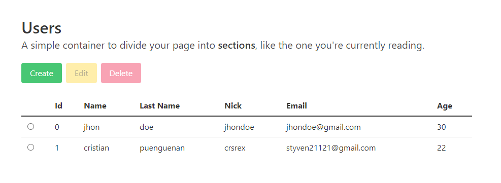

# Angular Testing Users Crud
This project is a crud of users that includes unit tests with 100% of coverage.

## Database server

Run `npm run db-server` json-server runs at url `http://localhost:3000/`.

## Run project

Run `npm run start` for a dev server. Browser automatically open project at url`http://localhost:4200/`. 

## Running unit tests

Run `npm run test:coverage` to execute the unit tests via [Karma](https://karma-runner.github.io).

This project was generated with [Angular CLI](https://github.com/angular/angular-cli) version 11.0.7.
